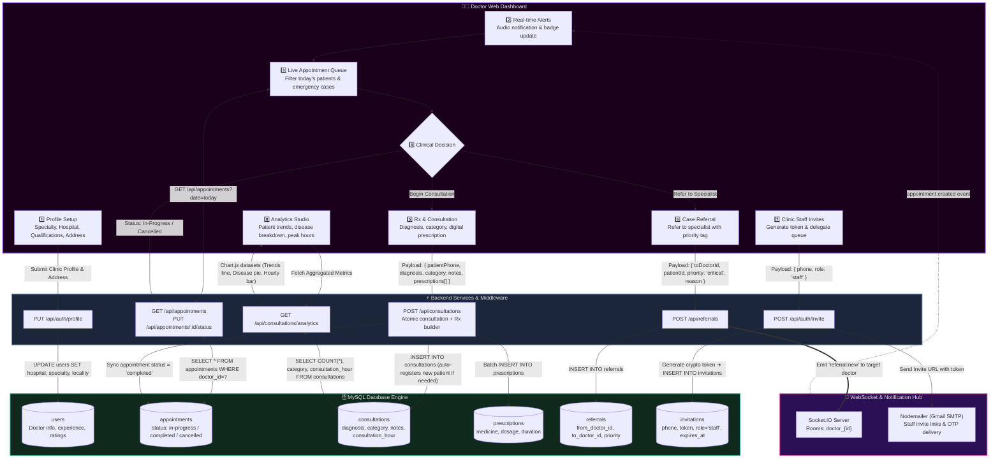
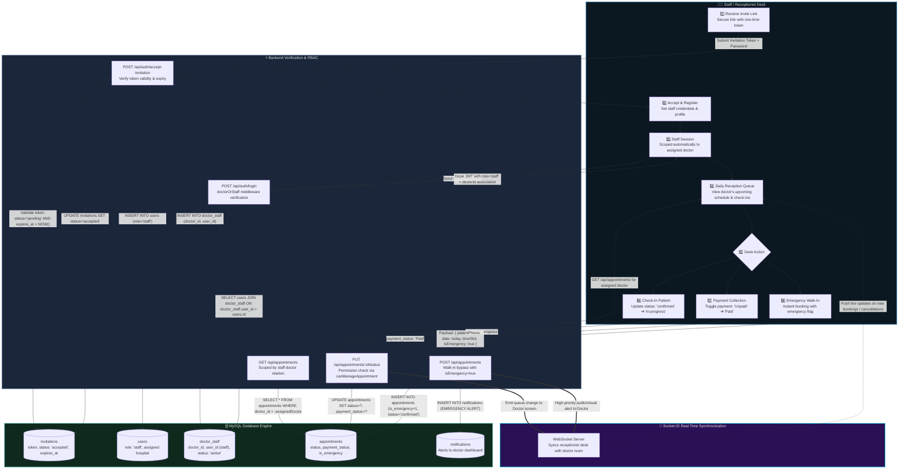
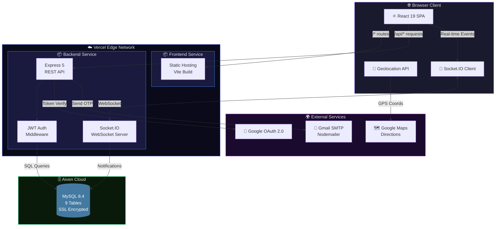
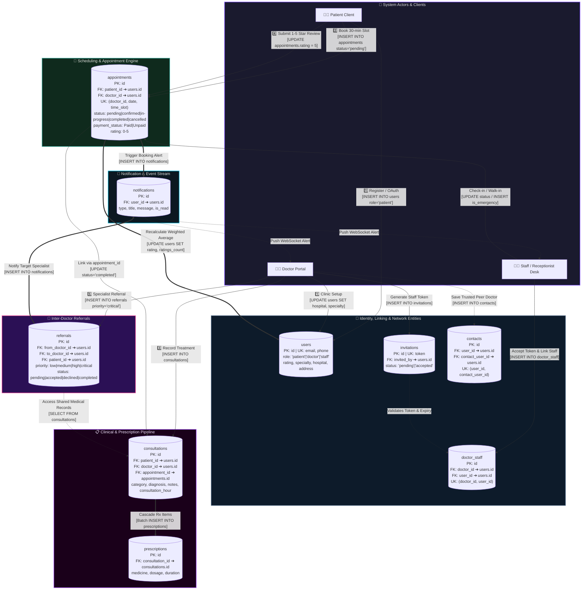
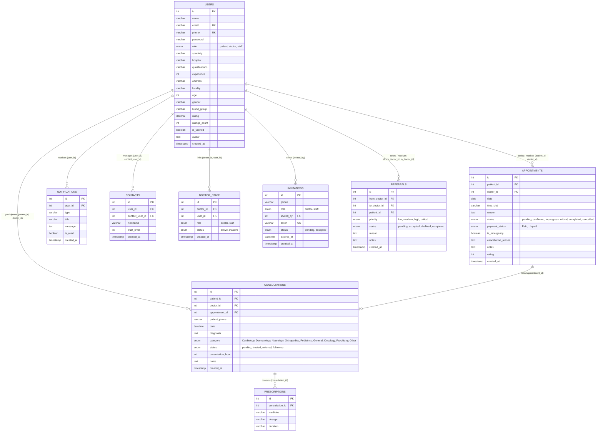

<div align="center">

  

  <br />

  # 🏥 MedZoo

  ### *Smart Healthcare & Doctor Appointment Platform*

  <br />

  [](https://medzoo.vercel.app)
  [](https://github.com/manikant1446/MedZoo/releases)
  [](LICENSE)
  [](https://medzoo.vercel.app)

  <br />

  <a href="https://medzoo.vercel.app">
    
  </a>
  <a href="https://medzoo.vercel.app">
    
  </a>
  <a href="https://medzoo.vercel.app">
    
  </a>
  <a href="https://medzoo.vercel.app">
    
  </a>
  <a href="https://medzoo.vercel.app">
    
  </a>
  <a href="https://medzoo.vercel.app">
    
  </a>
  <a href="https://medzoo.vercel.app">
    
  </a>
  <a href="https://medzoo.vercel.app">
    
  </a>

  <br /><br />

  > **MedZoo bridges the gap between patients and doctors** — enabling real-time appointment booking, digital consultations, GPS-powered clinic navigation, and complete clinic management — all in one platform.

  <br />

  [🚀 Live Demo](https://medzoo.vercel.app) · [🐛 Report Bug](https://github.com/manikant1446/MedZoo/issues) · [💡 Request Feature](https://github.com/manikant1446/MedZoo/issues)

</div>

<br />

---

<br />

## 🌍 The Real Problem MedZoo Solves

<table>
<tr>
<td width="50%">

### ❌ Before MedZoo

- 📞 Patients call clinics repeatedly for appointment availability
- 🏃 Walk-in visits waste hours in waiting rooms
- 📋 Paper-based medical records get lost or damaged
- 🗺️ Patients struggle to find clinic locations
- 📊 Doctors have no visibility into their practice analytics
- 🔕 No instant communication between doctor and patient
- 📄 Prescriptions are handwritten and often unreadable
- 🔄 Referrals between specialists happen through phone calls

</td>
<td width="50%">

### ✅ With MedZoo

- 🗓️ **Real-time slot availability** — book appointments in seconds
- 🏠 **Book from anywhere** — no more waiting room hassles
- 💾 **Digital medical records** — consultations, prescriptions stored forever
- 📍 **GPS directions** — one tap to navigate to the clinic
- 📊 **Live analytics dashboard** — patient trends, peak hours, ratings
- 🔔 **Instant WebSocket notifications** — real-time appointment updates
- 💊 **Digital prescriptions** — medicine, dosage, duration — all typed & clear
- 🤝 **Digital referral system** — refer patients with priority tagging

</td>
</tr>
</table>

<br />

> [!TIP]
> **MedZoo is not just an appointment app** — it's a complete healthcare operations platform for doctors, patients, and clinic staff, solving real problems that Indian clinics face every day.

<br />

---

<br />

## 🔄 How It Works — 2D Dynamic Workflows & Data Flow

<br />

### 🧑‍💻 1. Patient Journey — End-to-End Data Flow

```mermaid
flowchart TD
    subgraph CLIENT ["📱 Patient Client (React SPA)"]
        P_AUTH["1️⃣ Authentication<br/>Google 1-Tap OAuth or Email/Password"]
        P_SEARCH["2️⃣ Doctor Discovery<br/>Filter Specialty, Name, Locality"]
        P_SLOTS["3️⃣ Slot Picker<br/>Query 30-min live availability"]
        P_BOOK["4️⃣ Book Appointment<br/>Reason, notes, emergency flag"]
        P_GPS["5️⃣ Clinic Directions<br/>Geolocation API lat/lng coordinates"]
        P_RATE["6️⃣ Rate & Review<br/>1 to 5 star rating post-consultation"]
        P_HIST["7️⃣ Medical History<br/>Digital Rx, diagnoses, PDFs"]
    end

    subgraph API ["⚡ Express.js API Gateway"]
        E_AUTH["POST /api/auth/google<br/>POST /api/auth/login"]
        E_DOCS["GET /api/doctors?specialty=..."]
        E_SLOTS["GET /api/appointments/slots/:id/:date"]
        E_BOOK["POST /api/appointments"]
        E_RATE["POST /api/appointments/:id/rate"]
        E_HIST["GET /api/consultations/patient/:id"]
    end

    subgraph DB ["🗄️ MySQL Database Engine"]
        T_USERS[("users<br/>id, name, email, role, rating")]
        T_APPTS[("appointments<br/>UNIQUE(doctor_id, date, time_slot)<br/>status: pending / confirmed")]
        T_CONS[("consultations<br/>diagnosis, category, notes")]
        T_RX[("prescriptions<br/>medicine, dosage, duration")]
        T_NOTIF[("notifications<br/>user_id, type, message, is_read")]
    end

    subgraph SERVICES ["🌐 Real-Time & External APIs"]
        S_GOOGLE["Google OAuth 2.0 API<br/>Token verification"]
        S_MAPS["Google Maps Navigation<br/>Origin: GPS ➔ Destination: Clinic"]
        S_WS["Socket.IO Server<br/>Event: appointment:created"]
    end

    %% Step 1: Auth
    P_AUTH -->|"Send Google Token / Credentials"| E_AUTH
    E_AUTH <-->|"Verify ID Token"| S_GOOGLE
    E_AUTH <-->|"SELECT / INSERT user"| T_USERS
    E_AUTH -->|"Return JWT + User Profile"| P_AUTH

    %% Step 2: Discovery
    P_SEARCH -->|"Query: ?specialty=Cardiology"| E_DOCS
    E_DOCS <-->|"SELECT * FROM users WHERE role='doctor'"| T_USERS
    E_DOCS -->|"Doctor Profiles, Hospital, Avg Rating"| P_SEARCH

    %% Step 3: Slots
    P_SEARCH --> P_SLOTS
    P_SLOTS -->|"Req: doctorId + selectedDate"| E_SLOTS
    E_SLOTS <-->|"SELECT time_slot FROM appointments WHERE date=?"| T_APPTS
    E_SLOTS -->|"16 slots array [available: true/false]"| P_SLOTS

    %% Step 4: Booking
    P_SLOTS --> P_BOOK
    P_BOOK -->|"Payload: { doctorId, date, timeSlot, isEmergency }"| E_BOOK
    E_BOOK -->|"INSERT INTO appointments"| T_APPTS
    E_BOOK -->|"INSERT INTO notifications"| T_NOTIF
    E_BOOK ==>|"Emit 'appointment:created'"| S_WS
    S_WS -.->|"Push Real-Time Alert to Doctor & Staff"| CLIENT

    %% Step 5: GPS Navigation
    P_BOOK --> P_GPS
    P_GPS -->|"navigator.geolocation.getCurrentPosition()"| S_MAPS
    S_MAPS -->|"Open Directions: user lat,lng ➔ clinic address"| P_GPS

    %% Step 6: Rating
    P_GPS --> P_RATE
    P_RATE -->|"Payload: { rating: 5 }"| E_RATE
    E_RATE -->|"UPDATE appointments SET rating = 5"| T_APPTS
    E_RATE -->|"Recalculate users.rating & ratings_count"| T_USERS

    %% Step 7: History & Rx
    P_HIST -->|"Fetch Patient Consultations"| E_HIST
    E_HIST <-->|"SELECT consultations JOIN prescriptions"| T_CONS
    T_CONS -.->|"Include Rx Items"| T_RX
    E_HIST -->|"Structured Medical Records & Rx History"| P_HIST

    %% Visual Styling
    style CLIENT fill:#0d1b2a,color:#e0e1dd,stroke:#415a77,stroke-width:2px
    style API fill:#1b263b,color:#e0e1dd,stroke:#778da9,stroke-width:2px
    style DB fill:#0f2a1d,color:#e0e1dd,stroke:#2a9d8f,stroke-width:2px
    style SERVICES fill:#2b1055,color:#e0e1dd,stroke:#9d4edd,stroke-width:2px
```



<br />

### 👨‍⚕️ 2. Doctor Journey — Clinical & Management Workflow



<br />

### 👩‍💼 3. Staff Journey — Reception & Operations Workflow



<br />

---

<br />

## ✨ Features at a Glance

<br />

<table>
<tr>
<td align="center" width="33%">

### 🔍 Doctor Discovery

Search by **specialty, name, hospital, experience**. View live ratings & patient count. Filter: General, Cardiologist, Dermatologist, Neurologist, Psychiatrist, Dentist.

</td>
<td align="center" width="33%">

### 📅 Smart Booking

Dynamic **30-min time slots** based on real doctor availability. Pick date → see slots → book instantly. No double-booking guaranteed.

</td>
<td align="center" width="33%">

### 📍 GPS Navigation

Click **"Get Directions"** → browser asks location permission → opens Google Maps with **your GPS location → doctor's clinic** route.

</td>
</tr>
<tr>
<td align="center" width="33%">

### 📊 Analytics Dashboard

Interactive **Chart.js** charts: patient trends (line), disease categories (pie), peak hours (bar). Key metrics: total patients, consultations, avg rating.

</td>
<td align="center" width="33%">

### 💊 Digital Prescriptions

Multi-medicine builder per consultation. **Medicine name + dosage + duration** — all digital, searchable, and exportable as PDF.

</td>
<td align="center" width="33%">

### 🔔 Real-Time Alerts

**Socket.IO WebSocket** notifications. Instant updates for bookings, status changes, referrals, and emergency alerts. Read/unread tracking.

</td>
</tr>
<tr>
<td align="center" width="33%">

### 🤝 Case Referrals

Doctor-to-doctor referral with **priority tagging** (low → critical). Track status: pending → accepted → completed. Lookup by phone or email.

</td>
<td align="center" width="33%">

### 🔐 Secure Auth

**Google OAuth 2.0** 1-Tap + JWT + bcrypt. Role-based access (Patient/Doctor/Staff). OTP password recovery via email. Auto-logout on token expiry.

</td>
<td align="center" width="33%">

### 📄 PDF Reports

One-click **patient history export** — consultations, prescriptions, diagnoses — formatted as professional PDF using jsPDF + AutoTable.

</td>
</tr>
</table>

<br />

---

<br />

## 🛠️ Tech Stack

<br />

<table>
<tr>
<td align="center" width="25%">
<h3>⚛️ Frontend</h3>
</td>
<td align="center" width="25%">
<h3>🖥️ Backend</h3>
</td>
<td align="center" width="25%">
<h3>🗄️ Database</h3>
</td>
<td align="center" width="25%">
<h3>☁️ Infrastructure</h3>
</td>
</tr>
<tr>
<td valign="top">

| Tech | Ver |
|:---|:---:|
| React | 19.2 |
| Vite | 8.0 |
| React Router | 7.14 |
| Axios | 1.15 |
| Chart.js | 4.5 |
| Lucide Icons | 1.8 |
| jsPDF | 4.2 |
| Socket.IO Client | 4.8 |
| Google OAuth | 0.13 |

</td>
<td valign="top">

| Tech | Ver |
|:---|:---:|
| Node.js | 18+ |
| Express | 5.2 |
| MySQL2 | 3.9 |
| JWT | 9.0 |
| bcryptjs | 3.0 |
| Socket.IO | 4.8 |
| Multer | 2.1 |
| Nodemailer | 10.0 |
| Google Auth | 11.0 |

</td>
<td valign="top">

| Component | Detail |
|:---|:---|
| Engine | MySQL 8.4 |
| Host | Aiven Cloud |
| Tables | 9 |
| SSL | ✅ Enabled |
| Indexes | Optimized |
| FK | Cascading |

</td>
<td valign="top">

| Service | Provider |
|:---|:---|
| Hosting | Vercel |
| Frontend | Static |
| Backend | Serverless |
| DB | Aiven |
| OAuth | Google |
| Email | Gmail |

</td>
</tr>
</table>

<br />

---

<br />

## 🏗️ Architecture

<br />



<br />

### 🔀 Request Flow

```
1️⃣  User opens medzoo.vercel.app → Vercel Edge serves React SPA
2️⃣  SPA makes API calls → /api/* routed to Express serverless function
3️⃣  Express validates JWT → queries MySQL via connection pool (SSL)
4️⃣  Real-time events (appointments, alerts) → pushed via Socket.IO
5️⃣  Get Directions → Browser Geolocation API → Google Maps with GPS origin
6️⃣  Password Reset → Backend → Nodemailer → Gmail SMTP → User inbox
```

<br />

---

<br />

## 🗄️ Database Design & 2D Dynamic Data Flow

<br />

### 🔄 1. 2D Dynamic Database Architecture & Data Flow Diagram



<br />

### 🗃️ 2. Comprehensive Entity-Relationship Diagram (ERD)



<br />

### 📊 3. Data Lifecycle & Transaction Matrix

| Transaction / Event | Triggered By | Primary Table (Write) | Cascading / Affected Tables | DB Constraints Enforced | Real-Time Side-Effects |
|:---|:---|:---|:---|:---|:---|
| **Patient Registration / Google Login** | Patient | `users` (`INSERT`) | — | `email UK`, `phone UK`, bcrypt hash | Issues JWT Token (`role: patient`) |
| **Doctor Profile Setup** | Doctor | `users` (`UPDATE`) | — | Role verification (`role = 'doctor'`) | Updates discovery filters & cache |
| **Staff Invite & Onboarding** | Doctor / Staff | `invitations` (`INSERT`) | `users` (`INSERT`), `doctor_staff` (`INSERT`) | Crypto UUID `token UK`, `expires_at > NOW()` | Sends Invite Link via Nodemailer |
| **Slot Booking** | Patient / Staff | `appointments` (`INSERT`) | `notifications` (`INSERT`) | `no_double_booking (doctor_id, date, time_slot)` | Socket.IO `appointment:created` alert |
| **Consultation & Rx Creation** | Doctor | `consultations` (`INSERT`) | `prescriptions` (Batch `INSERT`), `appointments` (`UPDATE`) | FK `consultation_id ON DELETE CASCADE` | Live medical records update |
| **Doctor Rating & Review** | Patient | `appointments` (`UPDATE`) | `users` (`UPDATE rating, ratings_count`) | Rating bounds check (`1 <= rating <= 5`) | Updates doctor profile public score |
| **Specialist Referral** | Doctor | `referrals` (`INSERT`) | `notifications` (`INSERT`) | FKs `from_doctor_id`, `to_doctor_id`, `patient_id` | Socket.IO `referral:new` push to specialist |
| **Peer Doctor Contacts** | Doctor | `contacts` (`INSERT`) | — | `no_duplicate_contact (user_id, contact_user_id)` | Populates referral quick-pick list |

<br />

---

<br />

## 📡 API Endpoints

<br />

<details>
<summary><b>🔐 Authentication</b> — <code>/api/auth</code></summary>

<br />

| Method | Endpoint | Auth | Description |
|:---:|:---|:---:|:---|
| `POST` | `/register` | ❌ | Multi-step registration |
| `POST` | `/google` | ❌ | Google OAuth 1-Tap |
| `POST` | `/login` | ❌ | Email/phone + password |
| `POST` | `/forgot-password` | ❌ | Send OTP to email |
| `POST` | `/reset-password` | ❌ | Reset with OTP |
| `PUT` | `/change-password` | 🔒 | Authenticated change |
| `POST` | `/invite` | 🔒 | Generate staff invitation |
| `POST` | `/accept-invitation` | ❌ | Register via token |
| `GET` | `/me` | 🔒 | Current user profile |
| `PUT` | `/profile` | 🔒 | Update profile |

</details>

<details>
<summary><b>📅 Appointments</b> — <code>/api/appointments</code></summary>

<br />

| Method | Endpoint | Auth | Description |
|:---:|:---|:---:|:---|
| `GET` | `/` | 🔒 | List by role |
| `POST` | `/` | 🔒 | Book appointment |
| `GET` | `/patient` | 🔒 | My appointments |
| `GET` | `/slots/:doctorId/:date` | 🔒 | Available slots |
| `PUT` | `/:id/status` | 🔒 | Update status |
| `POST` | `/:id/rate` | 🔒 | Rate doctor |

</details>

<details>
<summary><b>📋 Consultations</b> — <code>/api/consultations</code></summary>

<br />

| Method | Endpoint | Auth | Description |
|:---:|:---|:---:|:---|
| `GET` | `/` | 🔒 | List consultations |
| `POST` | `/` | 🔒 | Create with prescriptions |
| `PUT` | `/:id` | 🔒 | Update consultation |
| `GET` | `/patient/:id` | 🔒 | Patient history |

</details>

<details>
<summary><b>👨‍⚕️ Doctors</b> — <code>/api/doctors</code></summary>

<br />

| Method | Endpoint | Auth | Description |
|:---:|:---|:---:|:---|
| `GET` | `/` | ❌ | Search & filter |
| `GET` | `/:id` | ❌ | Doctor profile |

</details>

<details>
<summary><b>🤝 Referrals</b> — <code>/api/referrals</code></summary>

<br />

| Method | Endpoint | Auth | Description |
|:---:|:---|:---:|:---|
| `GET` | `/` | 🔒 | Sent/received |
| `POST` | `/` | 🔒 | Create referral |
| `PUT` | `/:id/status` | 🔒 | Accept/decline |

</details>

<details>
<summary><b>🔔 Notifications</b> — <code>/api/notifications</code></summary>

<br />

| Method | Endpoint | Auth | Description |
|:---:|:---|:---:|:---|
| `GET` | `/` | 🔒 | Get notifications |
| `PUT` | `/:id/read` | 🔒 | Mark as read |
| `PUT` | `/read-all` | 🔒 | Mark all read |

</details>

<br />

---

<br />

## 📂 Project Structure

```
MedZoo/
├── 📁 frontend/                       # ⚛️ React 19 SPA (Vite 8)
│   ├── public/favicon.svg             # App icon
│   ├── src/
│   │   ├── App.jsx                    # Routes + ProtectedRoute guard
│   │   ├── main.jsx                   # Entry point
│   │   ├── config.js                  # API base URL
│   │   ├── index.css                  # Design system + dark theme
│   │   ├── contexts/
│   │   │   └── AuthContext.jsx        # Auth state + Axios interceptors
│   │   └── components/
│   │       ├── 📁 common/             # Shared (Login, Register, Profile, Navbar...)
│   │       ├── 📁 doctor/             # Dashboard, Appointments, Patients, Referrals
│   │       └── 📁 patient/            # Dashboard, Doctor Discovery + GPS Booking
│   └── vite.config.js
│
├── 📁 backend/                        # 🖥️ Express 5 REST API
│   ├── server.js                      # Express + Socket.IO + HTTP server
│   ├── index.js                       # Vercel serverless entry
│   ├── config/
│   │   ├── db.js                      # MySQL pool + auto-schema init
│   │   └── schema.sql                 # 9 tables DDL
│   ├── middleware/auth.js             # JWT verification
│   ├── routes/                        # auth, appointments, consultations,
│   │                                  # contacts, doctors, notifications, referrals
│   └── utils/
│       ├── notify.js                  # WebSocket notification helper
│       └── mailer.js                  # Nodemailer email service
│
├── vercel.json                        # Vercel services + rewrites
└── README.md
```

<br />

---

<br />

## 🚀 Quick Start

### Prerequisites

```
Node.js ≥ 18  •  MySQL 8.0+  •  npm ≥ 9
```

### Setup

```bash
# 1. Clone
git clone https://github.com/manikant1446/MedZoo.git
cd MedZoo

# 2. Install
cd backend && npm install
cd ../frontend && npm install

# 3. Configure backend/.env
DB_HOST=localhost
DB_PORT=3306
DB_USER=your_user
DB_PASSWORD=your_password
DB_NAME=medzoo
JWT_SECRET=your_secret
GOOGLE_CLIENT_ID=your_google_client_id
EMAIL_USER=your_email@gmail.com
EMAIL_PASS=your_app_password

# 4. Initialize DB (or let auto-init handle it)
mysql -u your_user -p < backend/config/schema.sql

# 5. Start
cd backend && npm run dev     # Port 5001
cd frontend && npm run dev    # Port 5173
```

Open **[http://localhost:5173](http://localhost:5173)** 🎉

<br />

---

<br />

## 🚢 Deployment

Deployed on **Vercel** with Services architecture:

```json
{
  "services": {
    "frontend": { "root": "frontend/", "framework": "vite" },
    "backend":  { "root": "backend/",  "entrypoint": "server.js" }
  }
}
```

```bash
npm i -g vercel && vercel --prod
```

> Set environment variables in **Vercel → Settings → Environment Variables**

<br />

---

<br />

## 🤝 Contributing

```
1. Fork → 2. Branch (feature/xyz) → 3. Commit → 4. Push → 5. Pull Request
```

<br />

## 📄 License

MIT License — free to use, modify, and distribute.

<br />

---

<div align="center">

  <br />

  **Built with ❤️ by [Manikant Kumar](https://github.com/manikant1446)**

  <br />

  [](https://medzoo.vercel.app)
  [](https://github.com/manikant1446/MedZoo)

  <br />

  If you found this project useful, please consider giving it a ⭐

  <br />

</div>
