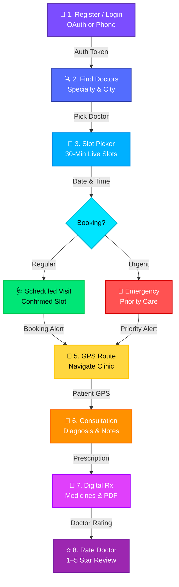
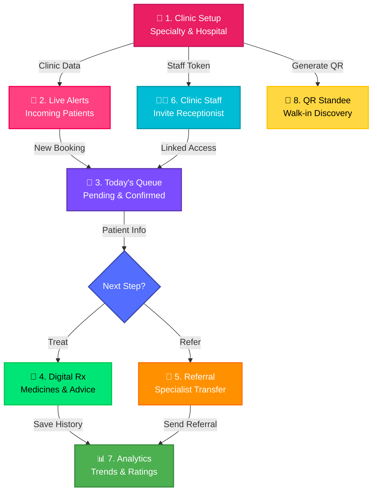
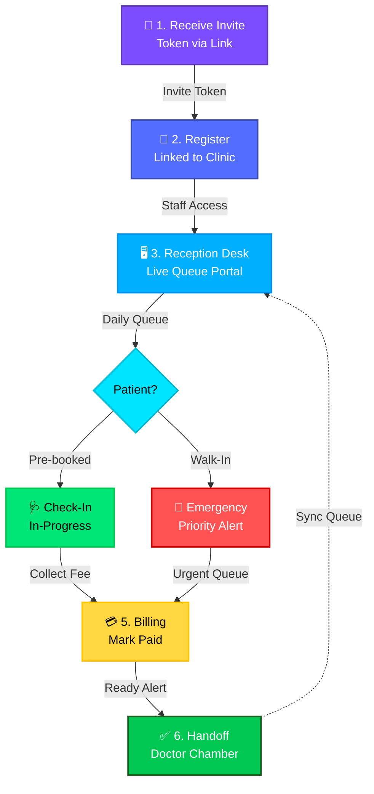
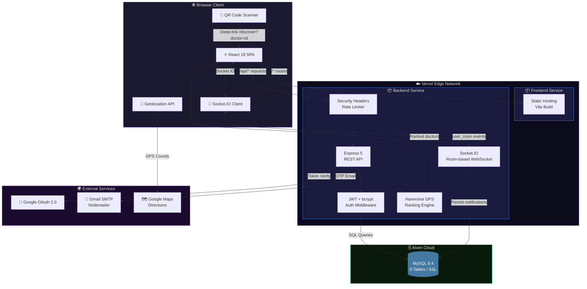
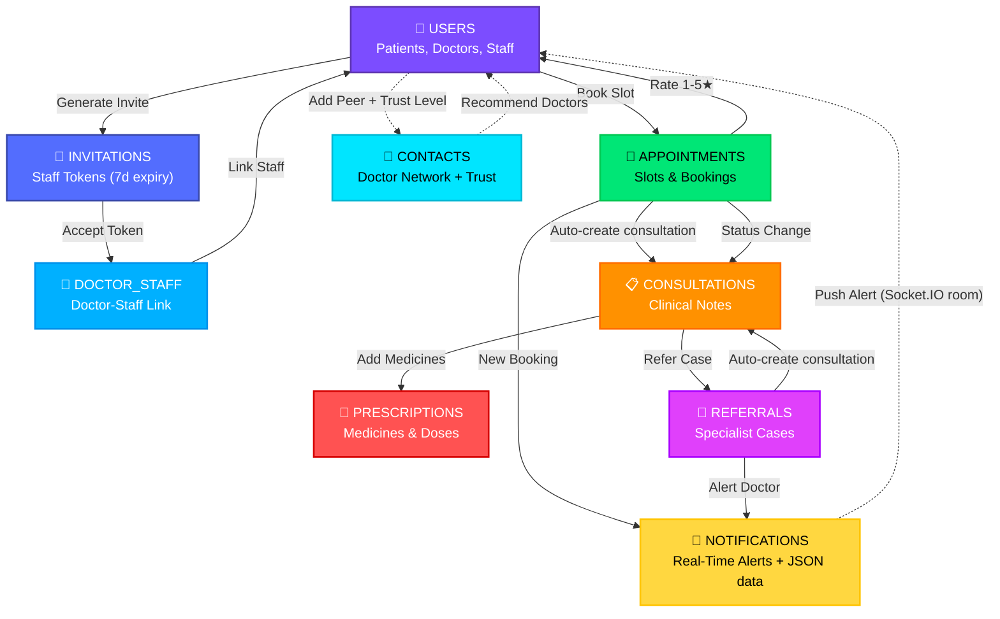
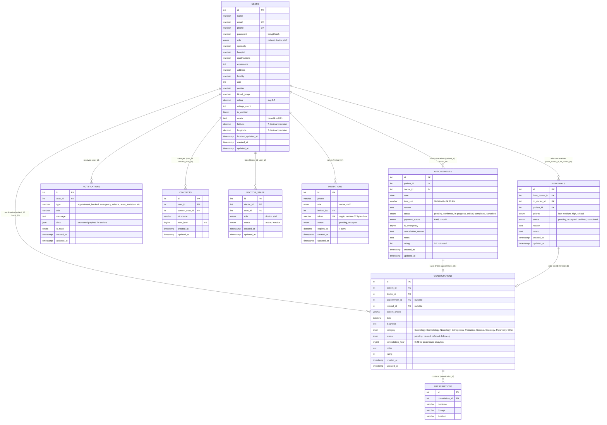

<div align="center">

  

  <br />

  # 🏥 MedZoo

  ### *Smart Healthcare & Doctor Appointment Platform*

  <br />

  [](https://medzoo.vercel.app)
  [](https://github.com/manikant1446/MedZoo/releases)
  [](LICENSE)
  [](https://medzoo.vercel.app)

  <br />

  <a href="https://medzoo.vercel.app">
    
  </a>
  <a href="https://medzoo.vercel.app">
    
  </a>
  <a href="https://medzoo.vercel.app">
    
  </a>
  <a href="https://medzoo.vercel.app">
    
  </a>
  <a href="https://medzoo.vercel.app">
    
  </a>
  <a href="https://medzoo.vercel.app">
    
  </a>
  <a href="https://medzoo.vercel.app">
    
  </a>
  <a href="https://medzoo.vercel.app">
    
  </a>

  <br /><br />

  > **MedZoo bridges the gap between patients and doctors** — enabling real-time appointment booking, digital consultations, GPS-powered clinic navigation, QR-based doctor profiles, and complete clinic management — all in one platform.

  <br />

  [🚀 Live Demo](https://medzoo.vercel.app) · [🐛 Report Bug](https://github.com/manikant1446/MedZoo/issues) · [💡 Request Feature](https://github.com/manikant1446/MedZoo/issues)

</div>

<br />

---

<br />

## 📌 Table of Contents

- [🌍 Problems MedZoo Solves](#-problems-medzoo-solves)
- [✨ Features — Detailed Breakdown](#-features--detailed-breakdown)
  - [🔐 1. Authentication & Onboarding](#-1-authentication--onboarding)
  - [🔍 2. Doctor Discovery & GPS-Ranked Search](#-2-doctor-discovery--gps-ranked-search)
  - [📅 3. Smart Appointment Booking](#-3-smart-appointment-booking)
  - [📍 4. GPS Navigation to Clinic](#-4-gps-navigation-to-clinic)
  - [🩺 5. Consultation & Digital Prescriptions](#-5-consultation--digital-prescriptions)
  - [📊 6. Analytics Dashboard (Doctor)](#-6-analytics-dashboard-doctor)
  - [🤝 7. Doctor-to-Doctor Referral System](#-7-doctor-to-doctor-referral-system)
  - [👩‍💼 8. Clinic Staff & Team Management](#-8-clinic-staff--team-management)
  - [🔔 9. Real-Time Notifications (WebSocket)](#-9-real-time-notifications-websocket)
  - [📄 10. PDF Report Export](#-10-pdf-report-export)
  - [📱 11. Doctor QR Code & Standee](#-11-doctor-qr-code--standee)
  - [👤 12. Profile Management & Avatars](#-12-profile-management--avatars)
  - [📍 13. Clinic Location Picker (Doctor)](#-13-clinic-location-picker-doctor)
  - [⭐ 14. Doctor Rating & Review System](#-14-doctor-rating--review-system)
  - [🛡️ 15. Role-Based Access Control](#-15-role-based-access-control)
- [🔄 How It Works — User Journeys](#-how-it-works--user-journeys)
- [🛠️ Tech Stack](#️-tech-stack)
- [🏗️ Architecture](#️-architecture)
- [🗄️ Database Design](#️-database-design)
- [📡 API Endpoints](#-api-endpoints)
- [📂 Project Structure](#-project-structure)
- [🚀 Quick Start](#-quick-start)
- [🚢 Deployment](#-deployment)
- [🤝 Contributing](#-contributing)
- [📄 License](#-license)

<br />

---

<br />

## 🌍 Problems MedZoo Solves

<table>
<tr>
<td width="50%">

### ❌ Before MedZoo

- 📞 Patients call clinics repeatedly for appointment availability
- 🏃 Walk-in visits waste hours in waiting rooms
- 📋 Paper-based medical records get lost or damaged
- 🗺️ Patients struggle to find clinic locations
- 📊 Doctors have no visibility into their practice analytics
- 🔕 No instant communication between doctor and patient
- 📄 Prescriptions are handwritten and often unreadable
- 🔄 Referrals between specialists happen through phone calls
- 👩‍💼 No streamlined way for clinic staff to manage reception queues
- 📱 No digital way for walk-in patients to discover a doctor at a clinic

</td>
<td width="50%">

### ✅ With MedZoo

- 🗓️ **Real-time slot availability** — book appointments in seconds
- 🏠 **Book from anywhere** — no more waiting room hassles
- 💾 **Digital medical records** — consultations, prescriptions stored forever
- 📍 **GPS directions** — one tap to navigate to the clinic
- 📊 **Live analytics dashboard** — patient trends, peak hours, ratings
- 🔔 **Instant WebSocket notifications** — real-time appointment updates
- 💊 **Digital prescriptions** — medicine, dosage, duration — all typed & clear
- 🤝 **Digital referral system** — refer patients with priority tagging
- 👩‍💼 **Staff portal** — receptionist manages queue, billing & check-ins
- 📱 **QR code standee** — walk-in patients scan QR → land on booking page

</td>
</tr>
</table>

<br />

> [!TIP]
> **MedZoo is not just an appointment app** — it's a complete healthcare operations platform for doctors, patients, and clinic staff, solving real problems that Indian clinics face every day.

<br />

---

<br />

## ✨ Features — Detailed Breakdown

Every feature below is **live and functional** on [medzoo.vercel.app](https://medzoo.vercel.app). Here's what each one does and the problem it solves.

<br />

### 🔐 1. Authentication & Onboarding

| What it does | How it works |
|:---|:---|
| **Google OAuth 1-Tap Login** | Patients/doctors sign in with their Google account in a single click — no password to remember. Uses `@react-oauth/google` + `google-auth-library` backend verification. |
| **Phone + Email Registration** | Multi-step registration form — basic info → role selection → doctor-specific fields (specialty, hospital, qualifications, experience). |
| **Post-OAuth Profile Completion** | If a user signs in with Google for the first time, they are redirected to `/complete-profile` to set phone number, password, role (patient/doctor), and doctor-specific details. |
| **Forgot Password (OTP via Email)** | User enters email → backend sends a 6-digit OTP via Gmail SMTP (Nodemailer) → user enters OTP + new password to reset. |
| **Change Password** | Authenticated users can change their password from the profile page with live strength validation (length, upper/lowercase, number, symbol). |
| **JWT-based Session** | Every login issues a 30-day JWT token. Stored in localStorage. Axios interceptors auto-attach token and handle 401 → auto-logout. |

> **Problem solved:** Eliminates friction in account creation. Patients who "just want to book" can do it with one Google tap. Doctors who need a full profile can complete it step-by-step.

<br />

---

### 🔍 2. Doctor Discovery & GPS-Ranked Search

| What it does | How it works |
|:---|:---|
| **Search by name, specialty, hospital** | Live search input filters doctors as user types. Works across name, specialty, and hospital fields. |
| **Filter by specialty** | Dropdown filter: General, Cardiologist, Dermatologist, Neurologist, Psychiatrist, Dentist. |
| **GPS-ranked results** | Patient's browser requests device GPS (Geolocation API). If allowed, doctors are **sorted by distance** from the patient. Clinic lat/lng stored in DB. |
| **Fallback to locality** | If GPS is denied or unavailable, doctors are ranked by the patient's saved locality (city/area). |
| **Doctor card details** | Each card shows: doctor name, specialty, hospital, experience (years), rating (1-5★), total patients, verified badge, locality, and distance (if GPS active). |

> **Problem solved:** A patient in a new city can open MedZoo, allow location, and instantly see the nearest cardiologist sorted by distance — no searching Google Maps separately.

<br />

---

### 📅 3. Smart Appointment Booking

| What it does | How it works |
|:---|:---|
| **Date picker** | Patient selects a future date. Only today and future dates are allowed. |
| **Dynamic 30-min time slots** | Backend generates 30-minute slots (09:00 AM → 06:30 PM). Already-booked slots for that doctor + date are excluded. |
| **No double-booking** | Database enforces `UNIQUE KEY (doctor_id, date, time_slot)` — it's physically impossible to double-book a slot. |
| **Emergency flag** | Patients can mark an appointment as "emergency" — it gets priority visibility for the doctor/staff. |
| **Booking reason** | Optional text field for patient to describe symptoms or purpose. |
| **Instant confirmation** | On successful booking, a WebSocket notification is pushed to the doctor in real-time. Patient gets a success confirmation. |
| **My Appointments tab** | Patients can switch to "My Appointments" tab to see all their bookings with status (pending, confirmed, in-progress, completed, cancelled). |

> **Problem solved:** No more calling the clinic 5 times to check slot availability. Patient sees exactly which slots are free and books instantly.

<br />

---

### 📍 4. GPS Navigation to Clinic

| What it does | How it works |
|:---|:---|
| **Get Directions button** | One-click button on each doctor card or appointment. |
| **Browser Geolocation API** | Requests user's current GPS coordinates (latitude, longitude). |
| **Google Maps integration** | Opens Google Maps with `origin=user's GPS` and `destination=clinic's lat,lng`. Full turn-by-turn navigation. |

> **Problem solved:** Patient doesn't need to separately search for the clinic address on Google Maps — one tap from MedZoo does it.

<br />

---

### 🩺 5. Consultation & Digital Prescriptions

| What it does | How it works |
|:---|:---|
| **Create consultation** | Doctor fills: patient phone/email, diagnosis, category (Cardiology, Neurology, etc.), status (pending/treated/referred/follow-up), and clinical notes. |
| **Auto-link patient** | Backend resolves the patient's phone number or email to their user account. If not registered, it still creates a record. |
| **Multi-medicine prescription builder** | For each consultation, doctor can add **multiple medicines** — each with name, dosage (e.g., "500mg twice daily"), and duration (e.g., "7 days"). |
| **Edit/update consultation** | Doctor can update diagnosis, status, notes, and add/remove prescriptions after creation. |
| **View consultation history** | Both doctor and patient can see full history of all consultations with prescriptions. |
| **Category classification** | Each consultation is tagged with a medical category (Cardiology, Dermatology, Neurology, Orthopedics, Pediatrics, General, Oncology, Psychiatry, Other) — feeds the analytics pie chart. |

> **Problem solved:** No more illegible handwritten prescriptions. Every medicine, dose, and duration is digitally recorded and searchable forever.

<br />

---

### 📊 6. Analytics Dashboard (Doctor)

| What it does | How it works |
|:---|:---|
| **Key metrics cards** | Total patients, total consultations, treatment success rate (%), average rating — all at a glance with trend indicators (↑/↓). |
| **Patient trend chart** | Interactive **Line chart** (Chart.js) showing patient count over time. Toggle between **daily** and **weekly** views. |
| **Disease category breakdown** | **Pie/Doughnut chart** showing distribution of consultations across categories (Cardiology, Neurology, etc.). |
| **Consultation status breakdown** | **Doughnut chart** showing treated vs pending vs referred vs follow-up counts. |
| **Peak hours analysis** | **Bar chart** showing which hours of the day have the most consultations — helps doctors optimize scheduling. |
| **Auto-refresh** | Dashboard auto-refreshes every 30 seconds. Manual refresh button also available. |

> **Problem solved:** Doctors running busy clinics have zero visibility into trends. MedZoo gives them a live analytics dashboard to understand their practice — peak hours, most common diseases, treatment success rate.

<br />

---

### 🤝 7. Doctor-to-Doctor Referral System

| What it does | How it works |
|:---|:---|
| **Create referral** | Doctor enters: receiving doctor's email, patient's email, reason for referral, notes, and **priority** (low / medium / high / critical). |
| **Incoming referrals tab** | Receiving doctor sees all incoming referrals with patient info, referring doctor, reason, priority badge, and status. |
| **Accept / Decline** | Receiving doctor can accept or decline each referral with one click. |
| **Outgoing referrals tab** | Referring doctor can track status of all sent referrals. |
| **Real-time notification** | When a referral is created, the receiving doctor gets an instant WebSocket notification. |

> **Problem solved:** Currently, doctor-to-doctor referrals happen over WhatsApp or phone calls with no tracking. MedZoo creates a formal referral system with priority tagging and status tracking.

<br />

---

### 👩‍💼 8. Clinic Staff & Team Management

| What it does | How it works |
|:---|:---|
| **Invite staff** | Doctor enters a phone number → system generates a unique **invitation token link** (e.g., `/accept-invitation/:token`). Link expires after set time. |
| **Staff registration** | Staff member opens the link → registers with name, phone, password → auto-linked to the doctor's clinic. |
| **Staff appointment access** | Staff (receptionist) gets their own dashboard = **AppointmentManager** — they can see all of the doctor's appointments, update statuses, and manage the daily queue. |
| **Team panel** | Doctor can see all active team members and pending invitations. Can cancel pending invitations or remove team members. |
| **Real-time team sync** | Socket.IO event `team_update_{userId}` pushes live updates when team changes happen. |
| **Leave clinic** | Staff can voluntarily leave a doctor's clinic from their dashboard. |
| **Payment status** | Staff can mark appointments as Paid/Unpaid for billing tracking. |

> **Problem solved:** A busy doctor can invite their receptionist to MedZoo. The receptionist manages the queue (check-in, mark paid, update status) while the doctor focuses on patients.

<br />

---

### 🔔 9. Real-Time Notifications (WebSocket)

| What it does | How it works |
|:---|:---|
| **Instant push notifications** | Socket.IO WebSocket connection per user. Events: `notification_{userId}` and `notification_broadcast`. |
| **Notification types** | Appointment booked, appointment status change, referral received, team update, emergency alert — each with a distinct icon and color. |
| **Bell icon with unread count** | Navbar shows a bell icon with a red badge showing unread count. |
| **Dropdown panel** | Click bell → dropdown shows all notifications sorted by newest. Each notification has: icon, title, message, timestamp, read/unread indicator. |
| **Mark as read** | Click a notification to mark it as read. "Mark all as read" button for bulk action. |
| **Delete notification** | Individual notification can be deleted. |

> **Problem solved:** Without real-time alerts, doctors miss new bookings until they manually refresh. MedZoo pushes instant notifications — no polling, no delay.

<br />

---

### 📄 10. PDF Report Export

| What it does | How it works |
|:---|:---|
| **One-click PDF** | On the Patients page, doctor clicks "Download PDF" → generates a formatted PDF of the patient's consultation and prescription history. |
| **Professional formatting** | Uses **jsPDF + jspdf-autotable** — tables with medicine name, dosage, duration. Includes doctor info header, patient info, diagnosis, notes. |
| **Searchable & shareable** | Generated PDF can be saved, printed, emailed, or shared via WhatsApp. |

> **Problem solved:** When patients ask for a printed summary of their treatments, the doctor can generate a professional PDF in one click — no manual typing.

<br />

---

### 📱 11. Doctor QR Code & Standee

| What it does | How it works |
|:---|:---|
| **Generate QR code** | Doctor opens QR modal from their profile → a QR code is generated encoding their **direct booking URL** (`/discover?doctor={id}`). |
| **High error-correction** | QR uses Level H error correction (can be 30% damaged and still scan). Sized at 500×500px for print clarity. |
| **Copy profile link** | One-click "Copy Link" button to share the booking URL via WhatsApp, SMS, etc. |
| **Download QR** | Download the QR code as a PNG image. |
| **Download clinic standee** | Download a **print-ready standee** (canvas-rendered) with doctor's name, specialty, hospital, and QR — ready to place at the clinic reception or door. |
| **Share via Web Share API** | Native OS share sheet to share the QR image with any app. |

> **Problem solved:** Walk-in patients at a clinic can scan the QR standee on the desk → land directly on the doctor's booking page → book an appointment instantly without waiting in line.

<br />

---

### 👤 12. Profile Management & Avatars

| What it does | How it works |
|:---|:---|
| **Full profile page** | Displays and edits: name, email, phone, role, age, gender, blood group, address, locality. |
| **Doctor-specific fields** | Specialty, hospital, qualifications, years of experience. |
| **Preset SVG avatars** | Choose from 4 illustrated avatars (Doctor Male, Doctor Female, Patient Male, Patient Female). |
| **Custom avatar upload** | Upload a profile photo (Base64 encoded, stored in DB). |
| **Live password strength** | When changing password, live indicators show: length ≥ 6, upper+lower case, number, symbol. |

> **Problem solved:** Personalized profiles build trust. Patients see the doctor's qualifications, experience, and photo before booking — not a blank card.

<br />

---

### 📍 13. Clinic Location Picker (Doctor)

| What it does | How it works |
|:---|:---|
| **Pin clinic location** | Doctor clicks "Pin My Clinic" → browser requests GPS → saves latitude/longitude to the doctor's profile. |
| **Update location** | Doctor can re-pin if they move clinics. Shows timestamp of last update. |
| **Clear location** | Doctor can clear saved location if needed. |
| **Used for patient distance ranking** | This saved lat/lng is what the Doctor Discovery page uses to calculate and sort by distance. |

> **Problem solved:** Without a fixed clinic location, GPS-based discovery can't work. This component lets doctors set their clinic's exact coordinates once — patients benefit every time.

<br />

---

### ⭐ 14. Doctor Rating & Review System

| What it does | How it works |
|:---|:---|
| **Rate after consultation** | After a consultation is completed, the patient can rate the doctor (1-5 stars) from their dashboard. |
| **Rate after appointment** | Patients can also rate from their appointments list. |
| **Aggregate rating** | Backend calculates weighted average: `new_rating = ((old_rating × old_count) + new_rating) / (old_count + 1)`. Stored as `rating` and `ratings_count` on the doctor's profile. |
| **Public display** | Rating (★ 4.8) and patient count shown on every doctor card in discovery. Higher-rated doctors stand out. |

> **Problem solved:** Patients have no way to gauge a doctor's quality before visiting. Ratings from real patients provide social proof and help patients choose better.

<br />

---

### 🛡️ 15. Role-Based Access Control

| Role | Dashboard | Can Access |
|:---|:---|:---|
| **Patient** | Patient Dashboard — consultation history, upcoming appointments, ratings | Doctor Discovery, Booking, My Appointments, Profile |
| **Doctor** | Doctor Dashboard — analytics charts, key metrics | Patients (consultations), Appointments, Referrals, Staff Management, QR Code, Profile |
| **Staff** | Appointment Manager — the doctor's appointment queue | Appointments (of assigned doctor), Profile |

- `ProtectedRoute` component checks `isAuthenticated`, `role`, and `isClinicStaff` before rendering.
- Staff gets `allowStaffAssignment` flag — can access doctor's appointments but not other doctor features.
- Unauthenticated users are redirected to `/login`. Wrong-role users are redirected to `/dashboard`.

> **Problem solved:** Without role-based access, any logged-in user could see anything. MedZoo enforces strict boundaries — a patient can't access doctor analytics, a staff can't create referrals.

<br />

---

<br />

## 🔄 How It Works — User Journeys

<br />

### 🧑‍💻 Patient Journey



<br />

### 👨‍⚕️ Doctor Journey



<br />

### 👩‍💼 Staff Journey



<br />

---

<br />

## 🛠️ Tech Stack

<br />

<table>
<tr>
<td align="center" width="25%">
<h3>⚛️ Frontend</h3>
</td>
<td align="center" width="25%">
<h3>🖥️ Backend</h3>
</td>
<td align="center" width="25%">
<h3>🗄️ Database</h3>
</td>
<td align="center" width="25%">
<h3>☁️ Infrastructure</h3>
</td>
</tr>
<tr>
<td valign="top">

| Tech | Ver |
|:---|:---:|
| React | 19.2 |
| Vite | 8.0 |
| React Router | 7.14 |
| Axios | 1.15 |
| Chart.js | 4.5 |
| Lucide Icons | 1.8 |
| jsPDF | 4.2 |
| Socket.IO Client | 4.8 |
| Google OAuth | 0.13 |
| QRCode (qrcode) | 1.5 |

</td>
<td valign="top">

| Tech | Ver |
|:---|:---:|
| Node.js | 18+ |
| Express | 5.2 |
| MySQL2 | 3.9 |
| JWT | 9.0 |
| bcryptjs | 3.0 |
| Socket.IO | 4.8 |
| Multer | 2.1 |
| Nodemailer | 10.0 |
| Google Auth | 11.0 |
| QRCode | 1.5 |

</td>
<td valign="top">

| Component | Detail |
|:---|:---|
| Engine | MySQL 8.4 |
| Host | Aiven Cloud |
| Tables | 9 |
| SSL | ✅ Enabled |
| Indexes | Optimized |
| FK | Cascading |

</td>
<td valign="top">

| Service | Provider |
|:---|:---|
| Hosting | Vercel |
| Frontend | Static |
| Backend | Serverless |
| DB | Aiven |
| OAuth | Google |
| Email | Gmail |

</td>
</tr>
</table>

<br />

---

<br />

## 🏗️ Architecture

<br />



<br />

### 🔀 Request Flow

```
1️⃣  User opens medzoo.vercel.app → Vercel Edge serves React 19 SPA
2️⃣  SPA makes API calls → /api/* → Express (Rate Limiter → Security Headers → JWT Auth)
3️⃣  Express validates JWT → queries MySQL 8.4 via SSL connection pool on Aiven
4️⃣  Doctors API: Haversine distance ranking → GPS-sorted response to patient
5️⃣  Real-time events → Socket.IO room (user_<id>) → targeted push to that user only
6️⃣  Notifications persisted to MySQL → fetched on reconnect (no lost events)
7️⃣  Get Directions → Browser Geolocation API → Google Maps with GPS origin
8️⃣  Password Reset → OTP generated → Gmail SMTP → User's inbox (10-min expiry)
9️⃣  QR Scan → Deep-link to /discover?doctor={id} → direct booking page
```

### 🔌 Socket.IO Room Events (Real-Time)

| Event Name | Direction | Triggered When |
|:---|:---|:---|
| `notification_{userId}` | Server → Client | Any notification created for that user |
| `notification_broadcast` | Server → Client | Broadcast with `userId` check on client |
| `appointment_update` | Server → All | Any appointment status/payment change |
| `emergency_trigger` | Server → `user_{doctorId}` | Emergency flag toggled on appointment |
| `team_update_{doctorId}` | Server → All | Staff joins, leaves, or invite cancelled |

<br />

---

<br />

## 🗄️ Database Design

<br />

### 🔄 1. Dynamic Database Architecture & Data Flow



<br />

### 🗃️ 2. Entity-Relationship Diagram (ERD)



<br />

### 📊 3. Key Database Constraints & Indexes

| Table | Constraint | SQL |
|:---|:---|:---|
| `appointments` | No double-booking | `UNIQUE KEY (doctor_id, date, time_slot)` |
| `contacts` | No duplicate pairs | `UNIQUE KEY (user_id, contact_user_id)` |
| `doctor_staff` | One record per pair | `UNIQUE KEY (doctor_id, user_id)` |
| `invitations` | Unique token | `UNIQUE KEY (token)` |
| `users` | Unique identity | `UNIQUE KEY (email)`, `UNIQUE KEY (phone)` |
| `consultations` | Fast doctor queries | `INDEX (doctor_id)`, `INDEX (patient_id)`, `INDEX (doctor_id, status)`, `INDEX (doctor_id, date)` |
| `referrals` | Fast lookup | `INDEX (from_doctor_id)`, `INDEX (to_doctor_id)` |
| `notifications` | Fast unread count | `INDEX (user_id, is_read, created_at)` |

<br />

### ⚙️ 4. Auto-Sync Logic (Appointment ↔ Consultation)

MedZoo keeps Appointments and Consultations in sync automatically:

| Trigger | What happens |
|:---|:---|
| Patient books appointment | Auto-creates a `consultation` row (status: `pending`) linked via `appointment_id` |
| Doctor creates referral | Auto-creates a `consultation` row (status: `referred`) linked via `referral_id` on the receiving doctor |
| Appointment → `completed` | Linked consultation → `treated` |
| Appointment → `cancelled` | Linked consultation → `DELETE` |
| Consultation → `treated` | Linked appointment → `completed` |
| Referral accepted | Linked consultation → `pending` |
| Referral declined | Linked consultation → `DELETE` |
| Referral completed | Linked consultation → `treated` |

<br />

### 📊 5. Data Lifecycle & Transaction Matrix

| Transaction / Event | Triggered By | Primary Table (Write) | Cascading / Affected Tables | DB Constraints | Real-Time Side-Effects |
|:---|:---|:---|:---|:---|:---|
| **Patient Registration** | Patient | `users` (`INSERT`) | — | `email UK`, `phone UK`, bcrypt-12 | Issues 30d JWT |
| **Google OAuth Login** | Patient/Doctor | `users` (`UPSERT`) | — | Email UK | Issues JWT + `isNewUser` flag |
| **Clinic Location Pin** | Doctor | `users` (`UPDATE lat/lng`) | — | Decimal geo validation | Enables GPS-ranked search |
| **Staff Invite (new user)** | Doctor | `invitations` (`INSERT`) | — | `token UK`, 7d expiry | Invite link generated |
| **Staff Invite (existing user)** | Doctor | `invitations` (`INSERT`) | `notifications` (`INSERT`) | `token UK`, 7d expiry | In-app notification pushed via Socket.IO |
| **Accept Invite (token link)** | Staff | `doctor_staff` (`INSERT`) | `invitations` (`UPDATE status`) | `UNIQUE (doctor_id, user_id)` | `team_update_{doctorId}` Socket.IO event |
| **Accept Invite (notification)** | Staff | `doctor_staff` (`UPSERT`) | `notifications` (`UPDATE`)| `ON DUPLICATE KEY UPDATE` | `team_update_{doctorId}` Socket.IO event |
| **Slot Booking** | Patient | `appointments` (`INSERT`) | `consultations` (`INSERT`), `notifications` (×3) | `no_double_booking UNIQUE` | Notifies doctor + all active staff + patient |
| **Appointment Reschedule** | Patient/Staff | `appointments` (`UPDATE`) | `consultations` (`UPDATE date/notes`) | Re-checks double-booking | `appointment_update` broadcast |
| **Emergency Toggle** | Patient/Staff | `appointments` (`UPDATE is_emergency`) | `notifications` (`INSERT`) | — | `emergency_trigger` to doctor's Socket.IO room |
| **Payment Toggle** | Staff/Doctor | `appointments` (`UPDATE payment_status`) | — | — | `appointment_update` broadcast |
| **Cancel with Reason** | Patient/Doctor/Staff | `appointments` (`UPDATE status=cancelled`) | `consultations` (`DELETE`) | — | `appointment_update` broadcast |
| **Consultation Create** | Doctor | `consultations` (`INSERT`) | `prescriptions` (Batch `INSERT`) | FK cascade | Medical record live |
| **Consultation Update** | Doctor | `consultations` (`UPDATE`) | `prescriptions` (DELETE+INSERT), `appointments` (`UPDATE`) | FK cascade | Appointment kept in sync |
| **Doctor Rating** | Patient | `appointments`+`consultations` (`UPDATE rating`) | `users` (`UPDATE rating, ratings_count`) | `1 ≤ rating ≤ 5` | Public doctor score updated |
| **Referral Create** | Doctor | `referrals` (`INSERT`) | `consultations` (`INSERT`), `notifications` (`INSERT`) | FK constraints | Real-time push to receiving doctor |
| **Referral Accept/Decline/Complete** | Doctor | `referrals` (`UPDATE status`) | `consultations` (`UPDATE/DELETE`) | Status check | Consultation status synced |

<br />

---

<br />

## 📡 API Endpoints

> All endpoints are mounted at `/api`. Auth-protected routes (🔒) require `Authorization: Bearer <JWT>` header.

<br />

<details>
<summary><b>🔐 Authentication</b> — <code>/api/auth</code></summary>

<br />

| Method | Endpoint | Auth | Role | Description |
|:---:|:---|:---:|:---:|:---|
| `POST` | `/register` | ❌ | Any | Register with phone + email + password |
| `POST` | `/google` | ❌ | Any | Google OAuth 1-Tap login/register |
| `POST` | `/login` | ❌ | Any | Login with phone or email + password |
| `GET` | `/me` | 🔒 | Any | Get current user profile |
| `PUT` | `/profile` | 🔒 | Any | Update profile (name, avatar, address, doctor fields, clinic lat/lng) |
| `POST` | `/complete-profile` | 🔒 | Any | Complete profile after Google OAuth (set phone, password, role) |
| `PUT` | `/change-password` | 🔒 | Any | Change password (requires current password) |
| `POST` | `/forgot-password` | ❌ | Any | Send 6-digit OTP to Gmail (10-min expiry) |
| `POST` | `/verify-otp` | ❌ | Any | Verify OTP before reset |
| `POST` | `/reset-password` | ❌ | Any | Reset password with OTP |
| `POST` | `/invite` | 🔒 | Doctor | Create staff invitation token (7-day expiry) |
| `GET` | `/invite/:token` | ❌ | Any | Lookup invitation details + check if user exists |
| `POST` | `/invite/accept` | ❌ | Any | Accept invite (new or existing user), joins doctor_staff |
| `GET` | `/team` | 🔒 | Doctor | Get active team members + pending invitations |
| `DELETE` | `/team/:id` | 🔒 | Doctor | Remove a team member from clinic |
| `DELETE` | `/invitations/:id` | 🔒 | Doctor | Cancel a pending invitation |
| `GET` | `/staff-assignments` | 🔒 | Staff | Get active clinic assignments for logged-in staff |
| `POST` | `/leave-clinic` | 🔒 | Staff | Voluntarily leave a doctor's clinic |

</details>

<details>
<summary><b>📅 Appointments</b> — <code>/api/appointments</code></summary>

<br />

| Method | Endpoint | Auth | Role | Description |
|:---:|:---|:---:|:---:|:---|
| `POST` | `/` | 🔒 | Patient/Staff | Book appointment (auto-creates consultation) |
| `GET` | `/patient` | 🔒 | Patient | My appointments list |
| `GET` | `/doctor` | 🔒 | Doctor/Staff | Doctor's appointment queue |
| `GET` | `/slots/:doctorId/:date` | 🔒 | Any | Available 30-min slots for a doctor on a date |
| `PUT` | `/:id/status` | 🔒 | Doctor/Staff/Patient | Update status (pending→confirmed→in-progress→completed/cancelled) |
| `PUT` | `/:id/edit` | 🔒 | Doctor/Staff/Patient | Reschedule — new date + time slot (checks double-booking) |
| `PUT` | `/:id/cancel-with-reason` | 🔒 | Doctor/Staff/Patient | Cancel with cancellation reason text |
| `PUT` | `/:id/payment` | 🔒 | Doctor/Staff | Toggle payment status (Paid ↔ Unpaid) |
| `PUT` | `/:id/emergency` | 🔒 | Doctor/Staff/Patient | Toggle emergency flag (triggers `emergency_trigger` Socket event) |
| `POST` | `/:id/rate` | 🔒 | Patient | Rate doctor 1–5 (recalculates doctor's average rating) |

</details>

<details>
<summary><b>📋 Consultations</b> — <code>/api/consultations</code></summary>

<br />

| Method | Endpoint | Auth | Role | Description |
|:---:|:---|:---:|:---:|:---|
| `POST` | `/` | 🔒 | Doctor | Create consultation + prescriptions (auto-registers unknown patient) |
| `GET` | `/doctor` | 🔒 | Doctor | All consultations for doctor (with prescriptions) |
| `GET` | `/patient` | 🔒 | Patient | Patient's own consultation history |
| `PUT` | `/:id` | 🔒 | Doctor | Update diagnosis, status, category, notes + replace prescriptions |
| `DELETE` | `/:id` | 🔒 | Doctor | Delete consultation (cascade deletes prescriptions) |
| `GET` | `/analytics` | 🔒 | Doctor | Analytics: daily/weekly counts, status breakdown, category breakdown, hourly peak hours |
| `POST` | `/:id/rate` | 🔒 | Patient | Rate a consultation (recalculates doctor's average rating) |

</details>

<details>
<summary><b>👨‍⚕️ Doctors</b> — <code>/api/doctors</code></summary>

<br />

| Method | Endpoint | Auth | Description |
|:---:|:---|:---:|:---|
| `GET` | `/` | 🔒 | Search & filter doctors. Supports `?specialty=`, `?search=`, `?lat=`, `?lng=`, `?locality=`. GPS-ranked via Haversine, with locality fallback. |
| `GET` | `/:id` | 🔒 | Single doctor profile with patient count |
| `GET` | `/public/:id` | ❌ | Public doctor profile for QR code landing pages (rate-limited, no email/phone) |

</details>

<details>
<summary><b>🤝 Referrals</b> — <code>/api/referrals</code></summary>

<br />

| Method | Endpoint | Auth | Role | Description |
|:---:|:---|:---:|:---:|:---|
| `POST` | `/` | 🔒 | Doctor | Create referral by email or phone (auto-creates consultation on receiving doctor) |
| `GET` | `/incoming` | 🔒 | Doctor | All referrals received by this doctor |
| `GET` | `/outgoing` | 🔒 | Doctor | All referrals sent by this doctor |
| `PUT` | `/:id/accept` | 🔒 | Doctor | Accept referral → linked consultation → pending |
| `PUT` | `/:id/decline` | 🔒 | Doctor | Decline referral → linked consultation deleted |
| `PUT` | `/:id/complete` | 🔒 | Doctor | Mark referral completed → linked consultation → treated |

</details>

<details>
<summary><b>🔔 Notifications</b> — <code>/api/notifications</code></summary>

<br />

| Method | Endpoint | Auth | Description |
|:---:|:---|:---:|:---|
| `GET` | `/` | 🔒 | Get last 50 notifications + unread count |
| `PUT` | `/read-all` | 🔒 | Mark all notifications as read |
| `PUT` | `/:id/read` | 🔒 | Mark single notification as read |
| `DELETE` | `/:id` | 🔒 | Delete single notification |
| `DELETE` | `/clear-all` | 🔒 | Delete all notifications for user |
| `POST` | `/:id/respond-invitation` | 🔒 | Accept or decline clinic invitation from notification (action: `accept` or `decline`) |

</details>

<details>
<summary><b>👥 Contacts</b> — <code>/api/contacts</code></summary>

<br />

| Method | Endpoint | Auth | Description |
|:---:|:---|:---:|:---|
| `GET` | `/` | 🔒 | List all contacts with user details |
| `POST` | `/` | 🔒 | Add contact by email + optional nickname + trust level |
| `DELETE` | `/:id` | 🔒 | Remove a contact |
| `GET` | `/trust-check/:doctorId` | 🔒 | Check if any of your contacts have visited this doctor |
| `GET` | `/recommended-doctors` | 🔒 | Get doctors trusted by your contacts (with trust score) |
| `POST` | `/sync` | 🔒 | Bulk sync contacts by phone or email array |
| `POST` | `/deny` | 🔒 | Record contacts permission denial |

</details>

<details>
<summary><b>🩺 Health Check</b> — <code>/api/health</code></summary>

<br />

| Method | Endpoint | Auth | Description |
|:---:|:---|:---:|:---|
| `GET` | `/health` | ❌ | Server status + timestamp |

</details>

<br />

---

<br />

## 📂 Project Structure

```
MedZoo/
├── 📁 frontend/                       # ⚛️ React 19 SPA (Vite 8)
│   ├── public/favicon.svg             # App icon
│   ├── src/
│   │   ├── App.jsx                    # Routes + ProtectedRoute guard
│   │   ├── main.jsx                   # Entry point
│   │   ├── config.js                  # API base URL
│   │   ├── index.css                  # Design system + dark theme
│   │   ├── contexts/
│   │   │   └── AuthContext.jsx        # Auth state + Axios interceptors
│   │   └── components/
│   │       ├── 📁 common/             # Shared components
│   │       │   ├── Login.jsx          # Email/phone login form
│   │       │   ├── Register.jsx       # Multi-step registration
│   │       │   ├── ForgotPasswordOTP.jsx # OTP-based password reset
│   │       │   ├── CompleteProfile.jsx # Post-OAuth profile setup
│   │       │   ├── AcceptInvitation.jsx # Staff invite acceptance
│   │       │   ├── Profile.jsx        # Full profile management + avatars
│   │       │   ├── Navbar.jsx         # Top navigation bar
│   │       │   ├── NotificationsDropdown.jsx # Real-time bell + dropdown
│   │       │   ├── ClinicLocationPicker.jsx  # GPS clinic pin (doctor)
│   │       │   ├── GoogleAuthButton.jsx     # Google 1-Tap button
│   │       │   └── ErrorBoundary.jsx  # React error boundary
│   │       ├── 📁 doctor/             # Doctor-only components
│   │       │   ├── DoctorDashboard.jsx # Analytics charts + metrics
│   │       │   ├── AppointmentManager.jsx # Queue + staff + invites
│   │       │   ├── PatientList.jsx    # Consultations + prescriptions + PDF
│   │       │   ├── ReferralManager.jsx # Referral create/accept/decline
│   │       │   └── DoctorQR.jsx       # QR code generator + standee
│   │       └── 📁 patient/            # Patient-only components
│   │           ├── PatientDashboard.jsx # History + upcoming + ratings
│   │           └── DoctorDiscovery.jsx  # Search + GPS + booking
│   └── vite.config.js
│
├── 📁 backend/                        # 🖥️ Express 5 REST API
│   ├── server.js                      # Express + Socket.IO + HTTP server
│   ├── index.js                       # Vercel serverless entry
│   ├── config/
│   │   ├── db.js                      # MySQL pool + auto-schema init
│   │   └── schema.sql                 # 9 tables DDL
│   ├── middleware/auth.js             # JWT verification
│   ├── routes/                        # auth, appointments, consultations,
│   │                                  # contacts, doctors, notifications, referrals
│   └── utils/
│       ├── notify.js                  # WebSocket notification helper
│       ├── mailer.js                  # Nodemailer email service
│       └── geo.js                     # Latitude/longitude validation
│
├── vercel.json                        # Vercel services + rewrites
└── README.md
```

<br />

---

<br />

## 🚀 Quick Start

### Prerequisites

```
Node.js ≥ 18  •  MySQL 8.0+  •  npm ≥ 9
```

### Setup

```bash
# 1. Clone
git clone https://github.com/manikant1446/MedZoo.git
cd MedZoo

# 2. Install
cd backend && npm install
cd ../frontend && npm install

# 3. Configure backend/.env
DB_HOST=localhost
DB_PORT=3306
DB_USER=your_user
DB_PASSWORD=your_password
DB_NAME=medzoo
JWT_SECRET=your_secret
GOOGLE_CLIENT_ID=your_google_client_id
EMAIL_USER=your_email@gmail.com
EMAIL_PASS=your_app_password

# 4. Initialize DB (or let auto-init handle it)
mysql -u your_user -p < backend/config/schema.sql

# 5. Start
cd backend && npm run dev     # Port 5001
cd frontend && npm run dev    # Port 5173
```

Open **[http://localhost:5173](http://localhost:5173)** 🎉

<br />

---

<br />

## 🚢 Deployment

Deployed on **Vercel** with Services architecture:

```json
{
  "services": {
    "frontend": { "root": "frontend/", "framework": "vite" },
    "backend":  { "root": "backend/",  "entrypoint": "server.js" }
  }
}
```

```bash
npm i -g vercel && vercel --prod
```

> Set environment variables in **Vercel → Settings → Environment Variables**

<br />

---

<br />

## 🤝 Contributing

```
1. Fork → 2. Branch (feature/xyz) → 3. Commit → 4. Push → 5. Pull Request
```

<br />

## 📄 License

MIT License — free to use, modify, and distribute.

<br />

---

<div align="center">

  <br />

  **Built with ❤️ by [Manikant Kumar](https://github.com/manikant1446)**

  <br />

  [](https://medzoo.vercel.app)
  [](https://github.com/manikant1446/MedZoo)

  <br />

  If you found this project useful, please consider giving it a ⭐

  <br />

</div>
